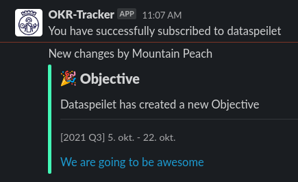
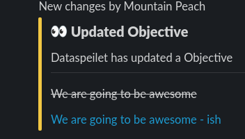
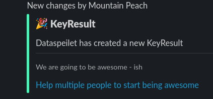
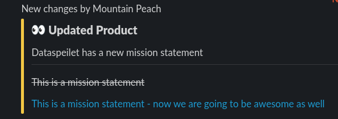

# Changelog

All notable changes to this project will be documented in this file. The format is based on [Keep a Changelog](https://keepachangelog.com/en/1.0.0/), and this project adheres to [Semantic Versioning](https://semver.org/spec/v2.0.0.html).

## [UNRELEASED]

### Fixed

- The date picker on the KPI details page no longer disappears when the selected
  period doesn't contain any measurements.

### Changed

- The period selector is moved to a more prominent position in the item tab bar.
  It also includes two more pre-defined periods: current and previous quarter.
- The API endpoints for updating key result and KPI progression values now
  accept an optional `comment` parameter.

## [3.4.0] 2023-03-03

### Fixed

- Fixed a bug where document references in a KPI document would be overwritten
  by resolved document data. This also includes a fix to the API which would
  fail while attempting to resolve these invalid document references.
- The state of an opened measurement edit form is now kept as is, even if the
  document has been updated in the background (e.g. while setting goals). This
  also prevents other data fields of the document, that might have been updated
  separately, from being overwritten with outdated data when saving the form
  (e.g. cached progress and goals).
- When deleting a user, all references to the user are now also removed from
  organization and department member lists, like it is for products.
- Date pickers used throughout the app now respect the selected language and
  are translated accordingly.

### Changed

- The admin link on the OKR page has been removed and is replaced by a separate
  tab in the item tab bar.
- Tag to indicate trend has been added to all KPI cards.
- The layout of most pages are now more unified. Some widgets previously found
  in the sidebars of each page has been removed and their contents moved
  elsewhere.
- The period selector now affects all measurements under the "Measurements" tab.
  It is also moved outside the result indicator box.
- Custom alerts have been replaced by the equivalent component from the [Punkt
  design system](https://punkt.oslo.kommune.no/latest/komponenter/alert/index).
- The page scroll manipulation when administrating measurements have been
  somewhat relaxed. When viewing details of a specific measurement, the admin
  tab now also links directly to the measurement in question.
- Added mini graphs to KPI cards.

## [3.3.0] 2023-02-03

### Added

- A tab bar has been added to the main item view (organization, department,
  product) to facilitate easier navigation between relevant sections: OKRs,
  measurements (previously called "Dashboard") and general about information.
- Tooltips are now also enabled for values and comments in the key result
  line chart.

### Changed

- All custom icon components are now replaced by counterparts from the [Punkt
  design system](https://punkt.oslo.kommune.no/latest/profil/ikoner/index).
- KPIs are now generally called "measurements" in the app. The different types
  of KPIs are kept as respectively "result indicators", "key figures" and
  (plain) "measurements".
- Any currently active period is now focused by default, instead of most
  recent, when visiting the OKR view.
- Progress bar styling has been improved for better differentiation between the
  empty and filled state.
- Dates in the period selector for measurements are now formatted to a more
  natural language in order to increase readability.
- In order to be more Punkt-compliant, the line chart area filler is no longer
  a gradient. It is instead replaced by a an opaque version of the current
  value line color.

### Removed

- Support for cookie based authentication has been removed from our APIs.

### Fixed

- Period progression is now updated when an objective is moved between periods.
- Fixed a bug causing text to sometimes overflow in tooltips and progress
  history tables.
- Fixed a bug where the key result details view in some cases would display
  the incorrect (parent) period if visited directly.
- The y axis of the key result progress graph now adapts to values outside its
  defined range instead of drawing outside the visible graph area.
- Fixed a bug in how error responses were returned from the access request API.

### Security

- Restricted the accept and delete endpoints in the request access API to ensure
  super admin status.

## [3.2.0] 2023-01-16

### Added

- A green checkmark icon is shown beneath the dashboard result indicator graph
  when the current goal has been reached within the period.

### Changed

- Google Sheets integrations now expect full Google Sheets URLs instead of the
  sheet IDs.
- Node 16 is now the default runtime for all Cloud Functions and when running
  the app locally.
- More informative error page views.
- Added contextual link to API documentation below curl example.
- Statistics shown beneath the dashboard result indicator graph (latest value
  and goal) now reflects the selected period.

### Removed

- The green color theme has been removed. It hasn't received much love lately,
  and our focus will rather be to better align the default blue theme with the
  Punkt design system going forward.
- Removed built-in Google Analytics integration. It was just default settings.
  Will probably be replaced by some other analytics tool once we select one
  that is compliant.

### Fixed

- Fixed a bug where saving a placeholder OKR period without changes would result
  in it being set to unix epoch.
- Fixed an incorrect admin rights check in the team widget.
- Charts now support displaying a single measurement.

## [3.1.0] 2022-12-15

### Changed

- The result indicator graph now defaults to showing all registered measurements
  in the dashboard.
- Values for key result progress are now rounded to maximum two decimal places
  when displayed.
- Renamed the heading and admin tab for "KPIs" to "measurements".
- The graphs trend tag does now differ on display type 'integer' and 'percentage'
  when displaying the increase/decrease for period.
- Current goals are now listed on the KPI admin page.
- Line chart tooltips have been redesigned.
- Usability improvements in the goal editing modal dialogue.
- Form validation improvements by displaying more detailed user feedback and
  preventing submit on form errors.

### Removed

- Removed the (unused) icon option field from the OKR objective edit menu.

### Fixed

- Fixed a bug where the right column on department pages would be hidden
  unintentionally.
- Fixed a bug where line charts would sometimes be rendered without goal lines.
- Added a missing Firestore index to make the admin feasibly fast again.

### Security

- Fixed a vulnerability regarding encoding of query strings to Firestore.

## [3.0.0] 2022-11-25

This release comprises nearly half a year of work and marks a change in how
development and releases will be handled onward.

The previous `master`, `develop`, and long lived feature branches are scrapped
in favor of a trunk based development workflow on the new `main` branch. From
here we will run continuous deployments toward our own instance of the OKR
Tracker, and strive to make new releases more frequently than before.

### Added

- The biggest change in this release is the new dashboard which is available for
  departments, displaying a summaries of their missions, target groups,
  products, KPI- and OKR statuses. The dashboard is reached from the "Dashboard"
  link in the right column on a department's front page.
- The update frequency, preferred trend, and type of a KPI can now be declared.
- New API endpoints have been added for listing, updating, and deleting KPI
  progression values.
- Added the ability to create, update, and delete progression values in the
  admin interface.
- Comments can now be added to measurements.
- Goals can now be set for KPIs.
- The curl command example can now be copied by using a button.
- A new `npm run deploy:feature_branch` command for easy deployment to Firebase
  preview channels.
- A new `npm run export_mock_data` command for exporting mock data from the
  Firebase emulator to the local file system.

### Changed

- More functional and accessible tabs on item admin and item home pages.
- More uniform styling of modal dialogues.
- Made modal dialogues easier to navigate by keyboard.
- An arbitrary number of KPIs can now be created for
  organizations/departments/products.
- Changed the resolution of measurements to daily. When multiple measurements
  exist on a single day, only the last measurement is taken into account.
- Improved number shortening/formatting.
- The KPI grid is made more compact and more responsive.
- The KPI admin page uses collapsible panels.
- The home page styling has been changed to accommodate displaying an arbitrary
  number of KPIs.
- More flexible team member listing – all roles can now be owned by more than
  one team member.
- KPIs can be updated by a Google Sheet integration and via the API
  simultaneously.
- Line chart styling and usability has been improved.
- The admin link section has been simplified by removing the shortcuts and
  having a single large link to the admin page instead.

### Removed

- Removed the previous dashboard view and all related code.
- Removed API endpoint returning the current user's authentication token.

### Fixes

- Various text and translation fixes.
- Fixed a display bug for radio buttons.
- Fixed listing of developers and designers.

### Security

- Fixed a vulnerability where users could escalate themselves to superusers.
- Fixed vulnerabilities in the key result and KPI APIs regarding how the team
  secret was verified.
- A bunch of security updates in dependencies.

## [2.7.5] 2022-06-17

### Changes

- Made archive options less prominent
- Made profile view as a right drawer
- Remove unused dependencies.
- Add rate limit to backend route handler.
- Use fetch instead of axios.
- Remove unused code for image upload.

### Fixes

- Fix can't read property position of null error for unauthenticated users.
- Set normalizeEmail gmail_remove_dots option to false
- Enable wrongly disabled update key result button

## [2.7.4] 2022-03-31

### Fixed

- Change label and button color in AddKPIModal to make it visable. Ref. issue #345.

## [2.7.3] 2022-03-21

- Auto accept access requests from whitelisted domains

## [2.7.2] 2022-01-27

### Changes

- Minor style changes

### Fixed

- Bugs in key result progress info

## [2.7.1] 2021-12-30

### Changes

- All text colors follow the chosen theme
- Use the only blue hover color the Oslo design system has to offer on both green and blue themes
- Line chart changes colors together with the theme

### Fixed

- Header title disappeared when opening the side drawer

## [2.7.0] 2021-12-29

OKR-tracker has been redesigned!

We have been working tirelessly for the last couple of months to give you a new design. We have tried to make it more robust, better UX for our users and a better navigation. Some information has been lifted, to give the user better information for their objectives and key results, and easier to update them respectively.

### Added

- Redesign: new design in all the right places. Giving the users a better way of showing the Objectives and Key Results
- Content Loaders! We have added content loaders to some of our components and hopefully this will increase the UX for our users
- Side menu has been changed to a drawer

### Changes

- Removed rights to update key results after a period has ended
- User page has been changed to a modal instead
- Reverted stylelint back to v13
- Updated dependencies

### Removed

- Breadcrumbs: it has been fun, but you are no longer welcome

## [2.6.2] 2021-12-09

### Fixed

- Cloud Functions: automatic backup and restore of the database has apparently not been working for a month

## [2.6.1] 2021-11-10

### Fixed

- Small bug with the public api after the big rewrite of Cloud Functions to ES Modules

## [2.6.0] 2021-11-09

Last minor update before releasing our new design. New updates from now on will only be small bug fixes.

### Changes

- Rewritten sass rules from @import to @use/@forward - hopefully easier to implement the new Oslo Design System
- Rewritten all the Cloud Functions to es modules - we can now write more future-proof code.
- Updated all dependencies of Cloud Functions
- Updated dependencies
- Updated stylelint to v14 and fixed all the breaking changes

### Fixed

- Not allowed to update Period if you only changed the name.
- Showing loading spinner when fetching KPI/KeyResult progress
- Moved widgets around for a better UX experience for mobile users
- When updating Org/Dep/Prod, the state store would get corrupt and only refresh fixed it. Double documents would show because vuexfire does not handle hundreds of documents that well.
- functions: config to active slackbot or not actually works

## [2.5.3] 2021-10-27

### Fixed

- KPI graph did not show if one progress object had a value equal to 0

## [2.5.2] 2021-10-19

### Fixed

- Actually fixed the bug showing `Update value`-button even if you did not have access

### Changes

- Small style changes for a better UX experience - in a series of different changes coming

## [2.5.1] 2021-10-19

### Fixed

- `Update value`-button in KeyResultHome was shown even though you did not have access to update

### Changes

- Removed sass-variables for colors, using CSS Variables instead
- Updated README with more information when deploying to prod for the first time
- Updated dependencies

## [2.5.0] 2021-10-14

We have added another slackbot integration. The new slackbot integration pushes changes to organizations/departments/products.

You can call the slack bot with the command `/okr`. The different commands to the slack bot are:

- `subscribe organization/department/product slug` - subscribe to a specific org/dep/prod
- `unsubscribe organization/department/product slug` - unsubscribe
- `subscribe/all organization/department slug` - subscribe to a specific org/dep/prod and all its children (departments/products)
- `unsubscribe/all organization/department slug` - unsubscribe to everything

What types of updates does the bot push?
Changes to the:

- name
- mission statement

Creation of:

- Objectives
- Key Results

Caveats:

- If you run subscribe/all once on an organization/department and create a new product after that
  - run subscribe/all again, because we don't add new children to the parent subscription

## Added

- Slack bot integration with channels in your slack organization. Push updates to a slack channel. (Read the readme about the changes and how to implement it)

Example:
`/okr subscribe product dataspeilet`

Now we would get updates to our slack channel with changes to our product, dataspeilet. (Mountain Peach is the name of our test user)

## Changes

- Save-buttons are disabled until changes have been made.
- Updated instructions on how to initialize a new okr-tracker instance
- KeyResultHome: moved widgets around for easier access to the edit button
- Updated dependencies

## [2.4.1] 2021-10-05

### Changes

- Format numbers to norwegian locale - thousands are separated with a space (atm we do not support other formatting locales for numbers)
- Moved some util-functions around
- Updated dependencies

### Fixed

- Team members could not create/update Periods/Objectives/KeyResults because of firestore rules
- Toaster for errors from creating Periods/Objectives/KeyResults did not show correctly

## [2.4.0] 2021-10-04

### Added

- Log in with Microsoft (Thank you, @knowit, for the changes)

### Removed

- Removed keycloak integration

## [2.3.1] 2021-09-28

### Fixed

- Normal team members were not actually allowed to update their own organization/department/product

## [2.3.0] 2021-09-28

We have added another lever of admin, called super admin. We are sorry, but you need to update some database documents to make this work.

Super Admin can:

- do the same things as an admin and normal member
- restore backups
- promote or demote admins
- migrate data
- create/restore/change organizations

Admins can:

- do the same things as a member
- add new users to the OKR-tracker
- administrate an organization they are apart of
- administrate multiple products within the same organization
- administrate multiple departments within the same organization

Member of a product or department or organization

- has rights to administrate its own product/org/departments
- ... such as add/remove members from a product/org/department
  - or update/delete/archive

### BREAKING CHANGES

- Added another lever of admin - super admin.
  - Add superAdmin-property to one user, and then that person can give others superAdmin-access
  - Super admin needs to go and update every single product/department/organization to support the new RBAC system (sorry for the inconvenience)

### Fixed

- Users were not allowed to archive its own product or department

## [2.2.1] 2021-09-23

### Added

- Job positions: added Storyteller

### Fixed

- i18n corrections
- Dashboard: PieChart not rendering correctly

## [2.2.0] 2021-09-14

### Added

- Users can choose what type of user they are from a predefined list of job positions. This is done in the `My Profile`-page
- PieChart follows color scheme

### Changes

- Styles
- TeamWidget: Multiple job positions are grouped into a parent position, i.e.: backend-, frontend-, mobile-, hardware-developers are grouped into `Developers`
- Updated dependencies
- Removed redundant firebase config environment keys
- Updated readme for a better understanding of firebase private keys

### Removed

- Removed sass-loader because we don't use webpack anymore

## [2.1.2] 2021-09-02

### Fixed

- Nothing happened when trying to archive Periods/Objectives/Key Results

## [2.1.1] 2021-08-31

### Changes

- Tab title changes together with the navbar title

## [2.1.0] 2021-08-30

We have removed vue-cli and moved to vitejs for better develop experience and faster build and deploy times. This also means that from now on that we won't support IE11 at all. The chance that IE11 shows only a white screen is highly possible. We only support evergreen/modern browsers

### Added

- Use Firebase auth emulator to emulate authentication (only for developers)

### Changes

- Moved from vue-cli to vitejs for our frontend build tool 🎉⚡🔥 Better, faster and leaner developer experience 🎉⚡🔥
- Removed collapse-icon if the item has no children

## [2.0.1] 2021-08-25

### Changes

- Sort KeyResults when in ObjectiveHome-view
- Removed some unnecessary code duplication
- Updated dependencies

## [2.0.0] 2021-08-23

We've decided to release v2 out of RC after almost a year of updates. We feel like the code is stable enough to warrant a v2 release. We haven't managed to develop all the features that we wanted, but we have already been working on a redesign for v2.1 for a couple of months now.

Our next steps are continuing to rewrite the way data is written to the database, move more and more out to a better API and hopefully open up our APIs to our users. And to look at a more robust RBAC with different levels.

See [release notes](./documentation/release-notes_v2.0.0.md).

### Added

- Add team members to Organizations and Departments to offload admin access

## [2.0.0-rc.12] 2021-08-19

### Fixed

- Keycloak: User met with infinite spinner if the user was not whitelisted in the database
- Sort organizations by name
- Small style fixes
- Correct modal size

### Changes

- Updated dependencies

## [2.0.0-rc.11] 2021-04-27

### Fixed

- Removed svg-loader - Icons were not showing correctly for some users
- Fixed SiteHeader not showing correct Prod/Dep/Org-name when doing changes to KPIs/OKRs
- Small fixes to components not using the correct color-styles

## [2.0.0-rc.10] 2021-04-27

We are looking at doing some design changes to the Objective/KeyRes-view, which means that some changes need to be made beforehand. We have therefore implemented a Theme Toggle! You can now toggle between Blue, Yellow and Green color themes.

### Added

- (Beta) Theme Toggle: toggle between Blue, Green or Yellow color themes
  - Switch color theme at the bottom of the sidebar or in the user-menu in the top right corner

### Changes

- Updated dependencies

## [2.0.0-rc.9] 2021-04-19

### Fixed

- ItemAdmin(org/dep/prod): Update failed if API Secret was empty

### Changes

- Updated dependencies

## [2.0.0-rc.8] 2021-03-26

### Added

- Added a security UUID for each team that needs to be sent with the api-call if you want to update KPI/KeyRes for better security.
  - Go to your Org/Dep/Product and add a secret under `API Secret`-input
- KPI: Show curl-example after adding a new KPI and toggled on updated via API
- Key Result: Show curl-example if you toggle the option "update via API"
- CF/API: better logging with express middleware morgan

### Changes

- KeyRes-Graph: if target value is higher than the current value, then expand the y-axis to not go under the x-axis or over the top of the y-axis
- KPIHome: format all values to correct format. Instead of floats -> format to percentage
- Better OpenSpec and API-gateway support.
- Moved API-KEY for Gateway from query-param to header

### Fixed

- CF/API: save progress (KPI/KeyRes) as a number and not a string
- CF/API: Fixed a bug with the KeyRes GET return two responses on the same GET-call which caused the API to crash

## [2.0.0-rc.7] 2021-03-23

### Added

- Cloud Functions: CRUD API for KPI and Key Results. It is now possible to call an end point if you want to update progress through the API and not through the frontend. Locked behind API Gateway with API key, get in contact to get a key.
- API Gateway: added gateway for users to call if they want access to API for KPI and Key Results. Needs API Key from us, contact us to get a key for your own team
- Swagger doc: read more about the new open API end points at https://okr.oslo.systems/api

### Changes

- Disable KPI auto update functionality if you would rather update through the API yourself
- Updated dependencies

### Fixed

- Key result progress "registered by" never showed anything if it was registered automatically by Cloud Functions

## [2.0.0-rc.6] 2021-03-17

OKR-tracker will get out of beta/RC by the end of June 2021. It has been in a beta-state for quite some time now, and we feel it has matured enough for a full release. This does not mean we will stop working on it, since we do have some milestones we would like to hit.

- Remove all client side db-changes. Move everything to a Cloud Function, in that way we can set up a more normal API CRUD backend and not rely on the client db-access.
- Most importantly: refactor RBAC - add different roles with different accesses

### Added

- Cloud Function: CRUD API for requestAccess and creation of user

### Changes

- Drop node-sass support
- Add dart-sass support

## [2.0.0-rc.5] 2021-03-01

### Added

- Dev-environment for users outside of Oslo kommune to test our application before forking/using
- Show User UID in profile
- Custom personalized sign in text for the keycloak sign-in button (default is `Sign in with keycloak`, new environment variable)

# Fixed

- Firestore rules: KeyRes were only allowed for uid-objects and not email-objects

## [2.0.0-rc.4] 2021-02-19

### BREAKING CHANGE

- Service account private key is not optional - it is required to add the private key json-file to firebase functions config (check out the [README](./README.md#supported-providers))
- Changes to environment variables - please read the [README](./README.md#environment-variables)
- Dropped support for Node < 14.x
- Required Node >= 14.x

### Experimental

- Keycloak integration: sign in using keycloak and use the keycloak token to create a custom token for firebase

### Added

- Keycloak integration
- Functions: tokenCreator - create custom tokens for custom auth integration with firebase
- LoadingSmall-component: a loading-animation that is smaller than the normal one
- Logout page: user is redirected here if there is a problem with signing in
- Store new unique id's to user-object for later migration to uid-control
- Alert-components

### Changes

- firestore-rules: Not allowed to read the user-objects without being signed in
- Better support to handling errors or if user does not have access to a resource
- Design of login page

### Removed

- Support for Node < 14.x

## [2.0.0-rc.3] 2021-01-26

### BREAKING CHANGE

- Drop IE 11 support

### Added

- Meta-tags for fb/twitter/open graph
- robots.txt

### Fixed

- Line chart should handle higher values even if it is higher than target value

### Changes

- Cron job changes to scheduled cloud functions
- Set time zone to Europe/Oslo for scheduled cloud functions
- Updated dependencies

## [2.0.0-rc.2] - 2021-01-20

### Added

- Show all comments in progression list for a key result

### Fixed

- Loading loop when trying to access site without credentials
- Automated key results not actually running automatically (cron job set to once a day)
- Line graph handling numbers >100k
- Progression not updating when archiving key results

### Changes

- Give cloud functions more memory and a longer timeout
- Better filter support in details page of a kpi

## [2.0.0-rc.1] - 2021-01-19

### Added

- Collapse rows of organizations and departments on the front page - save to user objects (everyone starts with collapsed)
- Search through items in the admin panel - if there are over 15 items respectively

### Fixed

- KeyResult: allow target value to be 0
- Allow decimals on inputs
- Show team members even though a period is not present

### Changes

- Items in the admin panel are sorted by name
- Departments and products are sorted by name in ASC order
- Small change to KPI for users - no number formatting when in ItemHome-view only in Home-view
- Updated dependencies

## [2.0.0-beta.9] - 2021-01-15

### Fixed

- Typo in cloud function code for KPIs
- Call cloud function in correct region - change from central1 to europe-west1

### Changes

- Updated dependencies

## [2.0.0-beta.8] - 2020-12-18

### Added

- Access to Team Drives for service accounts (if strict domain policy is enabled)

### Changes

- Better explanation about the Google Sheets information when adding KPIs
- Objectives/KeyResults are ordered alphabetically
- Updated dependencies
- Updated firestore indexes

## [2.0.0-beta.7] - 2020-12-14

### Changes

- Admin OKRs component - No need to fetch data every single time
- Updated dependencies

## [2.0.0-beta.6] - 2020-12-14

### Fixed

- Components in admin-okr not updating correctly

## [2.0.0-beta.5] - 2020-12-11

### Added

- Information about enabling Google Sheets API
- Allow use of decimal-numbers

### Removed

- vue-resize is not used
- Unused css-styles

### Changes

- Updated Firebase to 8.1.2
- More consistent BEM-naming
- Updated dependencies

## [2.0.0-beta.4] - 2020-11-29

### Changes

- Updated firebase storage rules to v2

## [2.0.0-beta.3] - 2020-11-29

### Added

- Filter KPI-progression
- E2E-tests (alpha)

### Changes

- Updated the design of `KpiHome.vue`
- Moved duplicate css-code to global
- Renamed html-tags to kebab-case
- Minor improvements to the code
- Updated prettier-config `arrowParens` from `avoid` to `always`

## [2.0.0-beta.2] - 2020-11-05

### Added

- English locale
- Store language preference on user
- Change language preference on profile page
- Markdown support on mission statements and key result notes
- Force order of KPIs + include non-existent KPIs on ItemHome

### Fixed

- Fix issue with findSlugAndRedirect-method - returns redirect and increased delay
- Add defaultPreferences on user if not existing (simplifies mock data creation)
- Remove misplaced markup on objective details widget
- Add missing translations
- Replaced 'deleted' with 'archived' in toaster
- Automatically archives related objectives and key results when archiving periods and objectives
- Improved Google Sheets integration guide on help page
- Display startValue if no currentValue is set on key result home view

## [2.0.0-beta] - 2020-11-03

Several breaking changes. See [release notes](./documentation/release-notes_v2.0.0-beta.md).

## [1.4.2] - 2020-04-22

### Added

- MIT License

### Changed

- Improve documentation

### Fixed

- Fix issue regarding saving `longDescription` for key results

## [1.4.1] - 2020-04-17

### Added

- Description-field for key-result. Ref. issue #106.

### Changed

- Upgrade dependencies

### Fixed

- User-search: sum of weighted keys is not allowed to exceed 1
- Typo in nb-no translation
- Objective-progression was always 0
- Products did not update accordingly when changing routes
- keyResultPage did not show longDescription correctly

## [1.4.0] - 2020-03-25

### Added

- Dynamic `<title>`s with `vue-meta`
- Ability to add comments when updating progress for a key result via toaster
- Display comments as tooltips on progressions list for a key result
- Fuzzy search for user list on admin panel with `Fuse.js`

### Changed

- Increase modal size for members chart
- Sortable columns for user list on admin panel

### Fixed

- Layout issue on key result page on certain page widths
- A few locale strings that were not mapped correctly
- Remove random word space before 'Home' in breadcrumbs
- Fix issue where progression for an empty objective shows as 'NaN'
- Fix z-index issue with the members modal

## [1.3.1] - 2020-03-18

### Changed

- Removed padding around force graph
- Better handling of responsive sizes for force graph

## [1.3.0] - 2020-03-18

### Added

- Visualising members of a department as a network graph
- Localization for nb-no with vue-i18n

### Changed

- Refactor all Cloud Functions
- Better documentation (jsdoc) for all Cloud Functions
- Show progress next to an _objective_ also when it's empty (0%)

### Fixed

- Fix bug where progression for objectives and periods did not get updated when a new (empty) key result was created
- Hide dashboard view for departments and organisations
- Fix error logged when toggling archived documents on admin panel

## [1.2.0] - 2020-03-11

OKRs are now supported on _organisation_ level. This will allow administrators to create and manage details (name, mission statement), objectives and key results for organisations.

_Organisations_ will work in a similar fashion as departments and products, whereas the child departments will be displayed on an organisation’s page. Please note that creating and/or deleting organisations is not included in this version.

### What’s new

- OKRs for organisation level
- Character limits for user inputs

### Added

- OKRs for organisation level
  - Edit existing organisations from the admin panel
  - Page to view organisations under route `/organization/<slug>`
  - Manage objectives and key results for organisation at `/organization/<slug>/edit`
  - Cloud functions to handle progression for organisation
- Supporting Markdown for mission statements

### Changed

- Convert the organisation in breadcrumbs to a link
- Use `placeholder-image.svg` instead of `placeholder-user.svg` for departments and products that do not have an image
- Consistently use American `organization` instead of `organisation` as function and variable names
- Reduce font weight on table of contents on help page
- Limit character count on various user inputs
  - `profile/displayName` <= 32 char
  - `organization/name` <= 64 char
  - `department/name` <= 64 char
  - `product/name` <= 64 char
  - `period/name` <= 12 char
  - `objective/description` <= 320 char
  - `objective/name` <= 160 char
  - `missionStatement` <= 320 char
  - `keyResult/description` <= 120 char
  - `keyResult/unit` <= 32 char
- Improved design on members and products lists (include name next to its image)
- Improved content on `help.md`
  - Managing products
  - Managing organisations
  - Managing dynamic periods
- Reduce size of image preview on forms for editing organisations, departments and products
- Visualise the (positive or negative) change on the newsfeed card for updating progress on a key result

### Deprecated

**Migrating data from Google Sheets:** Functionality for migrating data from Google Sheets should no longer be necessary. The scripts for handling this will remain in the codebase for now, but will soon be removed. The description and file upload will be removed in the UI.

### Removed

- Form for migrating data from Google Sheets

### Fixed

- Fix JSDoc errors in `db.js`

## [1.1.0] - 2020-03-09

This release introduces _dynamic date periods_ that replace static annual quarters for objectives. This means that custom date periods need to be manually created on each department and product onwards.

Under the ‘Danger Zone’ section on the admin view there is an action that automates the convertion of currently existing objecties onto dyamic date periods. This should only be triggered **once** in production after release of this version to prevent data loss.

This change adds a `/periods` subcollection on the `departments` and `products` collections that holds the details for the periods as well as the _progression_ for that period.

### Added

- Show callout to team members when a product image is missing
- Documentation for managing departments on Help page
- Automated backup of the firebase database
- Automated restore of backup for the firebase database

### Changed

- Converting static annual quarters to dynamic and custom date periods
  - Users can now create unlimited future (and past) periods
  - Users must give name date periods
  - Navigating between periods using URL query parameters
  - Adjustments in Cloud Functions to handle progression for dynamic periods
- Refactoring some Firestore handling – introducing the `serializeList` function to make the codebase a bit more DRY.
- Hide progress visualisation when department or product does not have any objectives

### Removed

- Legacy dashboard component

### Fixed

- Fix issue where progress graphic did not always update when navigating between pages
- Force the submenu to appear even when no periods are available
- Minor layout adjustment on the page header (less white space below page name on desktop)
- Allow floating point numbers as key result progress
- Replace _ninjas_ with _cubes_ when a department has zero products

## [1.0.2] - 2020-02-25

### Changed

- Upgrade dependencies

## [1.0.1] - 2020-02-24

### Added

- Table of contents on help page
- CHANGELOG.md

### Changed

- Fixed misleading text on help page for updating profile image
- Hide notes on key result page for non-members
- Improve styling of line chart (gradient fill)
- Increase size and quality for uploaded images
- Updated event-types.md with correct data

### Fixed

- Navigating to products/departments didn’t load the correct data
- Updating/changing a migrated key results

## [1.0.0] - 2020-02-21

First official release.
